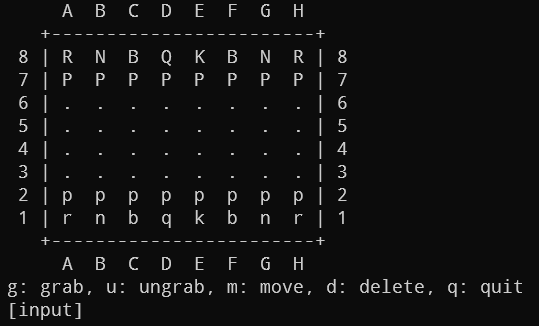

# chess

C++로 구현한 간단한 체스엔진

## 실행 화면



(엔진을 주로 구현하는거라 화면은 간단히만 구현함)

### 커맨드 목록

| 커맨드 | 설명 | 예시 |
|-|-|-|
| `gXX` | 말을 잡는 커맨드 | `gB1` |
| `u` | 잡은 말을 놓는 커맨드 ||
| `mXXYY` | 말을 옮기는 커맨드 | `mB1C3` |
| `mXX` | 잡은 말을 옮기는 커맨드 | `mC3` |
| `dXX` | 말을 삭제하는 커맨드 | `dE1` |
| `q` | 나가는 커맨드 ||

## 실행 방법

```bash
gcc main.cpp
./a.out
```

## 파일 목록

| 파일명 | 설명 |
|-|-|
| **`chess_engine.h`** | 대부분의 클래스 + 함수가 정의되어있는 파일 |
| **`chess_engine.cpp`** | `chess_engine.h`에서 정의된 함수들을 구현한 파일 |
| `chess_physical.h` | 실제 아두이노 환경 등에서 모터 등으로 체스 말을 옮길 예비 함수 |
| `chess_engine_print.cpp` | 체스판을 간단하게 출력해주는 함수가 들어있는 파일 |
| `main.cpp` | 메인 실행 파일 |
